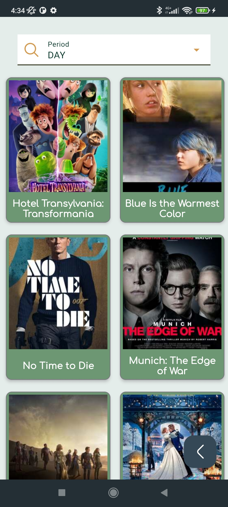

# AZMovie


[](https://lv.binarybabel.org/catalog/gradle/latest)
[](https://android-arsenal.com/api?level=21)


I have no right over the api itself and I do not guarantee that the material that will be present in this repository will be up-to-date and precise.
# Introduction
###
> AZMovie is a small android app for watching movies and series without any ads.


#### AZMOVIE allows users to do the following

1. View popular, now playing, upcoming and top rated movies ans series.
2. View Individual movies and get the movie data such as cast, movie duration, summary and description.
3. Search for Movies and Series.
4. Watch Movies And Series with subtitles.
5. See top perid(Day, Week, Month) weekly movies and series.


#### Introduction to the user

* Home Page for Top films and Series also Trailers -> Search button
* Movie Page with its details and buttom sheet for start stream the language you choose
* Series buttom sheet to choose season and then serie 
* Search page for searching series and movies
* Top Perid(Day, Week, Month) Movies and Series page


### Screenshots
###
Home Page | Movie Page | Movies Choose | Series Choose | Search Movies and Series
---|---|---|---|---
 |   | |  |  

Top Movies with period| Top Movies with period
---|---|
 |   
   
## Movie Subtitles -> 


## Project characteristics and tech-stack
* Tech-stack
    * [100% Kotlin](https://kotlinlang.org/) + [Coroutines](https://kotlinlang.org/docs/reference/coroutines-overview.html) - perform background operations
    * [Dagger2](https://github.com/google/dagger) - Dependency Injection lib with large community support.
    * [Retrofit](https://square.github.io/retrofit/) - Network Http Client
    * [Jetpack](https://developer.android.com/jetpack)
        * [Navigation](https://developer.android.com/topic/libraries/architecture/navigation/) - in-app navigation
        * [Flow](https://developer.android.com/kotlin/flow) 
        * [ViewModel](https://developer.android.com/topic/libraries/architecture/viewmodel) - store and manage UI-related data in a lifecycle conscious way
    * [Kodein](https://docs.kodein.org/) - dependency injection
    * [Glide](https://github.com/bumptech/glide) - image loading library
    * [Lottie](http://airbnb.io/lottie) - animation library
    * [okhttp-logging-interceptor](https://github.com/square/okhttp/blob/master/okhttp-logging-interceptor/README.md) - logs HTTP request and response data.
    * [Moshi](https://github.com/square/moshi) - Data, Model & Entity JSON Parser that understands Kotlin non-nullable and default parameters
    * [Paging 3](https://developer.android.com/topic/libraries/architecture/paging/v3-migration) -  Load and display paged data
* Modern Architecture
    * Clean Architecture (at feature module level)
    * Single activity architecture using [Navigation component](https://developer.android.com/guide/navigation/navigation-getting-started)
    * MVVM  (presentation layer)
    * [Dynamic feature modules](https://developer.android.com/studio/projects/dynamic-delivery)
    * [Android Architecture components](https://developer.android.com/topic/libraries/architecture) ([ViewModel](https://developer.android.com/topic/libraries/architecture/viewmodel), 
    * [Navigation](https://developer.android.com/jetpack/androidx/releases/navigation))
* UI
    * [Material design](https://material.io/design)
    * [Exoplayer](https://developer.android.com/guide/topics/media/exoplayer) - for streaming films
* Gradle
    * [Gradle Kotlin DSL](https://docs.gradle.org/current/userguide/kotlin_dsl.html)
    * Custom tasks
    * Plugins ([SafeArgs](https://developer.android.com/guide/navigation/navigation-pass-data#Safe-args),
      [android-junit5](https://github.com/mannodermaus/android-junit5))

The full list of dependencies are written in the **build.gradle** files.


## Getting started

There are a few ways to open this project.

### Android Studio

1. `Android Studio` -> `File` -> `New` -> `From Version control` -> `Git`
2. Enter `https://github.com/annzzu/AZMovie.git` into URL field an press `Clone` button

### Command-line + Android Studio

1. Run `git clone https://github.com/annzzu/AZMovie.git` command to clone project
2. Open `Android Studio` and select `File | Open...` from the menu. Select cloned directory and press `Open` button


`API in gradle.properties`
```gradle.properties
SERVER_URL=https://api.adjaranet.com/api/v1/
```

## Inspiration

This is project is a movie app, to watching your favorite series and movies with subtitles without any ads, for full comfort.


### Android projects by me
- [Covid Restrictions](https://github.com/annzzu/AZ) - AZ - For finding worldwide covid restriction and planing Travel.
